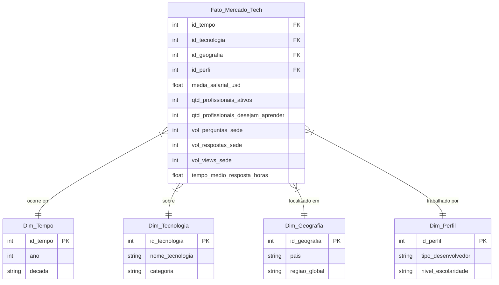
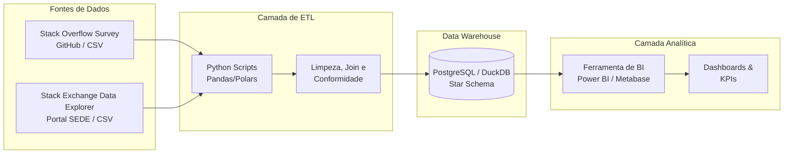

# Projeto: Evolução e Valorização das Tecnologias no Desenvolvimento de Software

## Autores
* Pedro Alonso
* Stephano Scaramussa

## 1. Tema e Problema de Negócio

**Tema:** Evolução e Valorização das Tecnologias no Desenvolvimento de Software.

**Problema de Negócio (Justificativa):** O mercado de tecnologia é caracterizado por ciclos rápidos de obsolescência e inovação. Profissionais de desenvolvimento, empresas recrutadoras e instituições de ensino enfrentam constantemente o desafio de identificar quais tecnologias estão em ascensão, quais estão perdendo espaço e como esses movimentos impactam a remuneração e a satisfação profissional. A ausência de uma visão consolidada e histórica dificulta o direcionamento de carreiras e a tomada de decisão estratégica por parte das empresas.

**Objetivo Analítico:** Esta solução de BI visa monitorar a evolução das stacks tecnológicas na última década, cruzando o engajamento da comunidade (Stack Exchange) e pesquisas diretas com desenvolvedores (Stack Overflow Survey), para responder: Quais as tecnologias mais rentáveis e promissoras ao longo do tempo, e como fatores geográficos e o perfil do desenvolvedor influenciam esse cenário?

## 2. Caracterização das Bases de Dados

Para o desenvolvimento desta solução, optamos por integrar duas fontes de dados da mesma família, mas com naturezas distintas (comportamental vs. declarativa), garantindo dados históricos de no mínimo 10 anos e alta densidade de variáveis.

**Base 1: Stack Exchange Data Explorer (SEDE)**

* **Fonte:** Portal oficial de consultas SQL da comunidade (data.stackexchange.com).
* **Período Abrangido:** 2011 a 2025.
* **Quantidade Aproximada de Registros:** Milhões de registros agregados em milhares de linhas (considerando contagem de posts, tags e visualizações por mês/ano).
* **Quantidade de Variáveis:** Customizável via SQL (ex: Ano, Mês, Nome da Tag, Contagem de Perguntas, Contagem de Respostas, Total de Visualizações).
* **Formato dos Dados:** CSV gerado a partir de extrações SQL.
* **Periodicidade:** Contínua (agruparemos anualmente para o Data Warehouse).

**Base 2: Stack Overflow Developer Survey**

* **Fonte:** Repositório oficial do GitHub (StackExchange/Survey) e portal Stack Overflow[cite: 2].
* **Período Abrangido:** Dados anuais disponíveis desde a edição de 2011 até a mais recente de 2025[cite: 2].
* **Quantidade Aproximada de Registros:** Entre 60.000 e 90.000 respondentes por ano.
* **Quantidade de Variáveis:** Varia anualmente de 60 a mais de 100 colunas (ex: Idade, País, Salário, Linguagens Trabalhadas).
* **Formato dos Dados:** Arquivos estruturados (CSV) prontos para processos de ETL.
* **Periodicidade:** Anual.

## 3. Justificativa e Análise Preliminar de Qualidade

A integração destas bases permite responder a perguntas de negócio complexas, cruzando a popularidade real de uma tecnologia (medida pelo volume de dúvidas e engajamento no SEDE) com o valor de mercado e sentimento (medidos pelos salários e desejos de adoção na Survey).

Durante a análise preliminar das bases, identificamos os seguintes desafios de qualidade que serão tratados na nossa camada de ETL em Python:

1. **Mudança de Esquema (Schema Drift) na Survey:** Ao longo das edições anuais (2011 a 2025)[cite: 2], a nomenclatura das colunas e as opções de resposta variaram substancialmente. Será necessário criar um dicionário de mapeamento (De/Para) na camada de Staging.
2. **Granularidade Temporal e Junção (Join):** O SEDE possui granularidade de data exata (criação do post), enquanto a Survey é uma foto anual. O ETL precisará agregar os dados do SEDE por Ano para viabilizar o relacionamento perfeito com a Survey através das chaves `Ano` e `Tecnologia (Tag)`.
3. **Atributos Multivalorados:** Na Survey, as respostas sobre linguagens de programação vêm em uma única string (ex: Python;SQL;Java). O ETL aplicará uma função de split para explodir essas strings em múltiplas linhas, garantindo o relacionamento N:M (Muitos para Muitos).
4. **Dados Ausentes (Missing Values):** Há um alto volume de valores nulos nas respostas de salário da Survey. O ETL aplicará regras de limpeza, removendo outliers extremos e tratando nulos para não distorcer as médias salariais.

## 4. Definição de KPIs e Perguntas Analíticas

**1. Taxa de Adoção de Tecnologia (YoY - Year over Year)**

* **Finalidade:** Medir o crescimento ou declínio do uso prático de uma linguagem ou framework específico em comparação ao ano anterior, utilizando os dados declarados na pesquisa.
* **Fórmula:** `((Qtd Devs que Usam a Tech Ano X - Qtd Devs Ano X-1) / Qtd Devs Ano X-1) * 100`
* **Agregação:** Variação percentual baseada na contagem de respostas da Survey por Ano e Tecnologia.

**2. Média Salarial Anualizada (USD) por Tecnologia e Região**

* **Finalidade:** Identificar as competências tecnológicas mais valorizadas financeiramente no mercado global e regional, ajudando a mapear onde estão os melhores salários para cada stack.
* **Fórmula:** `Média(Salário Anual Convertido em USD)`
* **Agregação:** Média monetária agrupada por Dimensão Tecnologia e Dimensão Geografia (País).

**3. Índice de Desejo Tecnológico (Future Demand)**

* **Finalidade:** Mapear tendências futuras e o hype do mercado medindo a proporção de desenvolvedores que não usam uma tecnologia hoje, mas declaram o desejo de usá-la no próximo ano.
* **Fórmula:** `(Qtd Devs que Desejam Trabalhar com a Tech / Total de Devs Entrevistados no Ano) * 100`
* **Agregação:** Percentual em relação ao total da amostra anual da Survey.

**4. Volume Absoluto de Tração Técnica (SEDE)**

* **Finalidade:** Quantificar o tamanho real da comunidade de uma tecnologia através do volume de tópicos criados, servindo de base para cruzar com o desejo medido na KPI 3.
* **Fórmula:** `Soma(Total de Novas Perguntas com a Tag Específica)`
* **Agregação:** Contagem absoluta de postagens do SEDE agrupada por Ano e Tecnologia.

**5. Índice de Engajamento Real vs. Declarado (Hype Index)**

* **Finalidade:** Medir se uma tecnologia que aparece como muito desejada na pesquisa anual realmente reflete um aumento prático de uso e dúvidas na comunidade.
* **Fórmula:** `(Volume de Perguntas sobre a Tech no SEDE no Ano X) / (Total de Desenvolvedores que usam a Tech na Survey no Ano X)`
* **Agregação:** Razão anual por Dimensão Tecnologia.

**6. Custo-Escassez por Especialista**

* **Finalidade:** Identificar as linguagens de nicho altamente rentáveis, avaliando se altos salários são impulsionados por baixo volume de profissionais na base.
* **Fórmula:** `Média Salarial Anualizada da Tech` cruzada com o `% de Representatividade da Tech no Total de Respondentes`.
* **Agregação:** Valor financeiro vs. Percentual, agrupado por Tecnologia e Perfil de Desenvolvedor.

**7. Taxa de Obsolescência Comunitária**

* **Finalidade:** Detectar tecnologias em declínio antes que o mercado financeiro reaja, observando a queda no suporte da comunidade.
* **Fórmula:** `((Total de Visualizações e Respostas no SEDE Ano X) - (Total Ano X-1)) / (Total Ano X-1) * 100`
* **Agregação:** Variação percentual (YoY) do volume de interações.

**8. Força da Comunidade (Time-to-Answer)**

* **Finalidade:** Avaliar a maturidade do ecossistema de uma tecnologia, cruzando se ecossistemas mais maduros (respostas mais rápidas) pagam salários melhores ou piores.
* **Fórmula:** `Tempo Médio (em minutos/horas) entre a Criação da Pergunta e a Primeira Resposta Aceita no SEDE`.
* **Agregação:** Média de tempo por Ano e Tecnologia.

## 5. Modelagem Multidimensional (Star Schema)

Para suportar as análises temporais, geográficas e as KPIs propostas, adotaremos uma modelagem em Star Schema (Esquema Estrela), garantindo performance nas agregações da ferramenta de BI.

* **Granularidade da Tabela Fato:** A granularidade será agregada no nível Anual por Tecnologia, Geografia e Perfil de Desenvolvedor. Como o SEDE e a Survey possuem grãos originais diferentes (interações diárias vs. questionário anual), a camada de ETL consolidará as métricas em fotos (snapshots) anuais.
* **Medidas (Métricas Quantitativas):**
* `media_salarial_usd`
* `qtd_profissionais_ativos`
* `qtd_profissionais_desejam_aprender`
* `vol_perguntas_sede`
* `vol_respostas_sede`
* `vol_views_sede`

* **Dimensões e Hierarquias:**
* **Dim_Tempo:** Ano (Hierarquia Simples, dado que a Survey é anual).
* **Dim_Tecnologia:** ID da Tecnologia, Nome Oficial, Categoria (Linguagem, Banco de Dados, Framework, etc.).
* **Dim_Geografia:** ID Localidade, País, Continente/Região Econômica.
* **Dim_Perfil:** ID Perfil, Nível de Escolaridade, Tipo de Desenvolvedor (Back-end, Front-end, Data Engineer, etc.).

**Diagrama do Modelo de Dados (Mermaid):**

## 6. Proposta Inicial da Arquitetura de BI

A arquitetura da solução foi desenhada com foco em simplicidade, reprodutibilidade e escalabilidade, utilizando um ecossistema moderno de dados. O fluxo abrangerá desde a extração até a visualização final, permitindo análises temporais dos dados desde a edição de 2011[cite: 2].

A arquitetura será dividida em 4 camadas principais:

1. **Data Sources (Fontes de Dados):**
* Extração dos arquivos CSV disponibilizados no repositório do GitHub da Stack Overflow Developer Survey[cite: 2].
* Extração de bases tabulares via consultas SQL diretas no portal do Stack Exchange Data Explorer (SEDE).

2. **Data Ingestion & ETL (Camada de Transformação):**
* **Ferramenta:** Python (bibliotecas pandas ou polars).
* **Papel:** Responsável por ler os dados brutos, realizar o mapeamento de esquemas (lidando com as mudanças de colunas das pesquisas ao longo dos anos), explodir colunas multivaloradas (separação de strings de tecnologias), remover outliers salariais e consolidar os dados anualmente na granularidade da Tabela Fato.

3. **Data Warehouse (Camada de Armazenamento):**
* **Ferramenta:** PostgreSQL (ou alternativamente DuckDB / SQLite para facilitar a reprodutibilidade no GitHub).
* **Papel:** Hospedar fisicamente o Modelo Multidimensional (Star Schema). Esta camada garantirá a integridade referencial entre a `Fato_Mercado_Tech` e as dimensões (`Dim_Tempo`, `Dim_Tecnologia`, `Dim_Geografia`, `Dim_Perfil`).

4. **Data Visualization (Camada de BI e Dashboards):**
* **Ferramenta:** Power BI, Metabase ou Looker Studio.
* **Papel:** Conectar-se ao Data Warehouse e consumir o Star Schema para a construção dos painéis interativos. Esta camada será responsável por agregar os dados visualmente e responder às 8 KPIs definidas no escopo analítico.

**Diagrama Arquitetural (Mermaid):**

